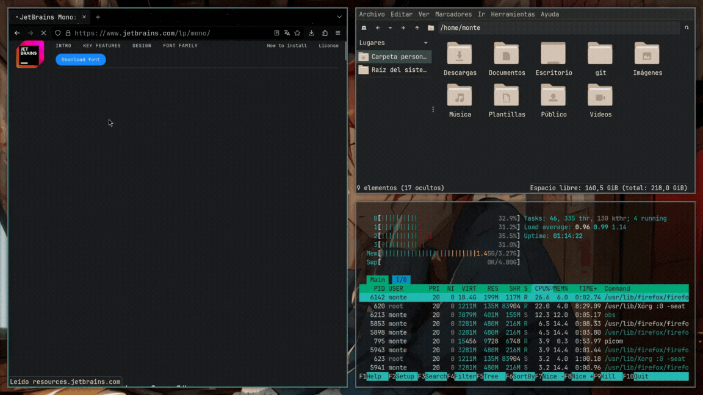

<h1 align="center">i3wm Gruvbox Sayori</h1>
<h4 align="center">Config files for i3wm</h4>

<a href="#dependencies">Dependencies & Fonts</a> 
<a href="#shortcuts">Shortcuts</a> 

<h4>
They are the dotfiles of my i3wm configuration, you just have to clone the git and put the .config files in your gnu/linux operating system
</h4>

<h2>preview i3wm, picom, alacritty</h2>
  
  
<h2>preview rofi (dmenu & rofi-power-menu)</h2>
  

<h1 align="center">Dependencies & Fonts</h1>
<h4>Dependencies can be Easily Installed from Terminal</h4>

| ***Dependencies***                   |
| -----                                |
| alacritty                            |
| pcmanfm                              |
| feh                                  |
| rofi                                  |
| xclip                                |
| maim                                 |

| ***Font***                           |
| -----                                |
| JetBrains Mono Nerd Font             |

https://www.nerdfonts.com/font-downloads

<h2>Shortcuts</h2>

| ***Key***                            | ***Action***               |
| -----                                | -----                      |
| ***Software***                       | ***Action***               |
| Super + t                            | alacritty                  |
| Super + a                            | rofi -show drun             |
| Super + Shift + q                    | rofi -show power-menu       |
| Super + e                            | pcmanfm                    |
| Print                                | maim, xclip                |
| -----                                | -----                      |
| ***i3wm***                           | ***Action***               |
| Super + q                            | kill focused window        |
| Super + Left, Down, Up, Right        | toggle window focus        |
| Super + Shift + Left,Down,Up,Right   | move focused window        |
| Super + Space                        | toggle floating/tiling      |
| Super + f                            | toggle fullscreen          |
| Super + 1,2,3,4,5,6,7,8,9,0          | focus desktop 1-9          |
| Super + Shift + 1,2,3,4,5,6,7,8,9,0  | move window to desktop 1-9 |
| Super + Shift + r                    | restart i3wm               |
